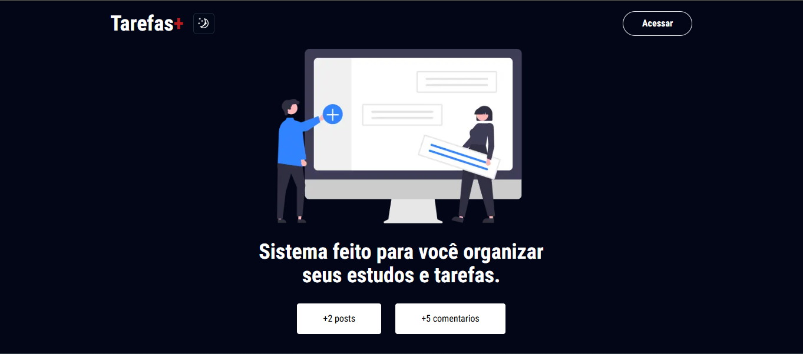

# ToDoApp - Gerencie suas Tarefas com Facilidade e Eficiência



## Descrição

O **ToDoApp** é uma aplicação web moderna e intuitiva para gerenciamento de tarefas pessoais ou em equipe. Desenvolvido com as mais recentes tecnologias web, o ToDoApp oferece uma experiência de usuário fluida e eficiente para organizar seu dia a dia, aumentar sua produtividade e manter o controle de suas responsabilidades.

Com o ToDoApp, você pode:

*   **Criar e Organizar Tarefas:** Adicione novas tarefas com títulos, descrições detalhadas e defina datas de vencimento.
*   **Categorizar Tarefas:** Utilize categorias ou tags para organizar suas tarefas por projeto, prioridade ou contexto.
*   **Marcar como Concluídas:** Acompanhe seu progresso marcando tarefas como concluídas e visualize seu histórico de realizações.
*   **Interface Responsiva:** Acesse e gerencie suas tarefas de qualquer dispositivo, seja desktop, tablet ou smartphone, graças ao design responsivo.
*   **Temas Personalizáveis:** Escolha entre temas claro e escuro para personalizar a aparência da aplicação de acordo com sua preferência.
*   **Notificações (Parcialmente implementado):** Receba notificações (via Toaster) para lembretes de tarefas e atualizações importantes. Por hora, apenas criação, exclusão e adição de tarefas e comentários possuem notificação.
*   **Autenticação de Usuários:** Crie contas de usuário para manter suas tarefas privadas e seguras.
*   **Sincronização em Tempo Real:**  Acesse suas tarefas de qualquer lugar e veja as atualizações em tempo real (se você implementou essa funcionalidade com o Firebase).

## Tech Stack

Este projeto foi construído utilizando as seguintes tecnologias:

*   **Frontend:**
    *   **Next.js 14:** Framework React para construção de aplicações web de alta performance com renderização do lado do servidor (SSR) e rotas otimizadas.
    *   **React:** Biblioteca JavaScript para construção de interfaces de usuário interativas e reativas.
    *   **Tailwind CSS:** Framework CSS utilitário para estilização rápida e consistente, permitindo criar interfaces bonitas e responsivas com facilidade.
    *   **shadcn/ui:** Conjunto de componentes de interface de usuário reutilizáveis e acessíveis, construídos sobre Radix UI e Tailwind CSS, para acelerar o desenvolvimento e garantir uma experiência de usuário de alta qualidade.
    *   **sonner (Toaster):** Biblioteca para exibir notificações "toast" elegantes e informativas para feedback do usuário.
*   **Backend e Banco de Dados:**
    *   **Firebase:** Plataforma Backend-as-a-Service (BaaS) do Google para autenticação, banco de dados (Firestore ou Realtime Database), e outras funcionalidades backend (se você utilizou Firebase para backend).

## Funcionalidades Principais

*   Criação, edição e exclusão de tarefas.
*   Marcação de tarefas como concluídas/pendentes.
*   Organização de tarefas por categorias/tags.
*   Visualização de tarefas em listas e (opcionalmente) calendários ou outros formatos.
*   Interface de usuário moderna e intuitiva.
*   Responsividade para diferentes dispositivos.
*   Temas claro e escuro com animação suave.
*   Notificações informativas via Toaster.
*   Autenticação de usuários para segurança e personalização.
*   Sincronização de dados em tempo real via Firebase.

## Começando

Siga estes passos para executar o projeto localmente:

### Pré-requisitos

*   **Node.js** (versão 18 ou superior recomendada) instalado em sua máquina. Você pode baixar em [nodejs.org](https://nodejs.org/).
*   **npm** ou **yarn** (gerenciador de pacotes) instalado. npm é instalado com o Node.js. Yarn pode ser instalado globalmente com `npm install -g yarn`.
*   **Conta no Firebase:** Se você utiliza o Firebase para backend, você precisará de uma conta no [Firebase](https://firebase.google.com/) e um projeto Firebase configurado.

### Instalação

1.  **Clone o repositório:**
    ```bash
    git clone [URL do seu repositório]
    cd [nome-do-repositorio]
    ```

2.  **Instale as dependências:**
    ```bash
    npm install  # ou yarn install
    ```

3.  **Configuração das Variáveis de Ambiente:**
    *   Crie um arquivo `.env.local` na raiz do projeto.
    *   Adicione as variáveis de ambiente necessárias. Se você usa Firebase, você precisará das configurações do seu projeto Firebase. Exemplo (ajuste com suas configurações do Firebase):

        ```env
        NEXT_PUBLIC_FIREBASE_API_KEY=SUA_API_KEY_FIREBASE
        NEXT_PUBLIC_FIREBASE_AUTH_DOMAIN=SEU_AUTH_DOMAIN_FIREBASE
        NEXT_PUBLIC_FIREBASE_PROJECT_ID=SEU_PROJECT_ID_FIREBASE
        NEXT_PUBLIC_FIREBASE_STORAGE_BUCKET=SEU_STORAGE_BUCKET_FIREBASE
        NEXT_PUBLIC_FIREBASE_MESSAGING_SENDER_ID=SEU_MESSAGING_SENDER_ID_FIREBASE
        NEXT_PUBLIC_FIREBASE_APP_ID=SEU_APP_ID_FIREBASE
        # ... outras variáveis de ambiente que você possa precisar
        ```

        **Importante:** Substitua os valores de exemplo (`SUA_API_KEY_FIREBASE`, etc.) pelas configurações reais do seu projeto Firebase. Consulte a documentação do Firebase para encontrar essas informações no console do seu projeto.

### Executando o Servidor de Desenvolvimento

```bash
npm run dev  # ou yarn dev